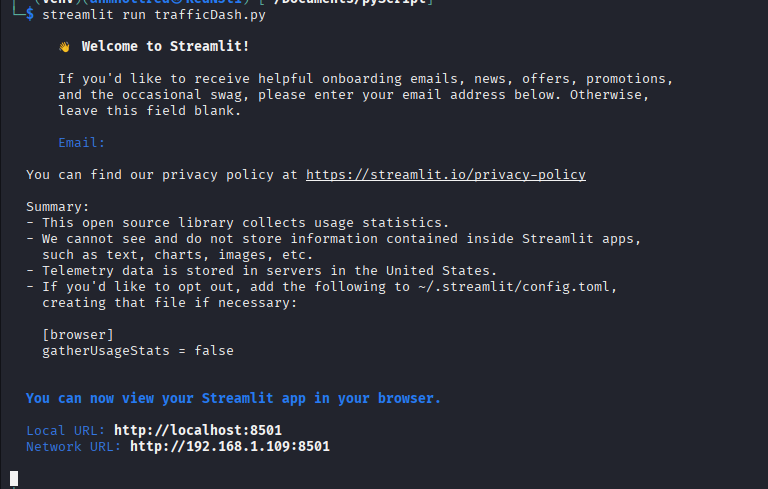
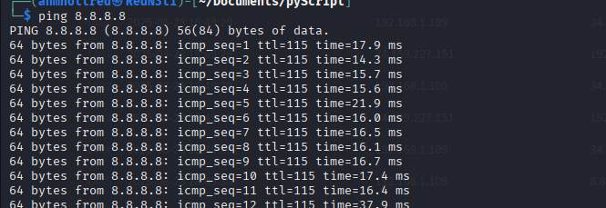
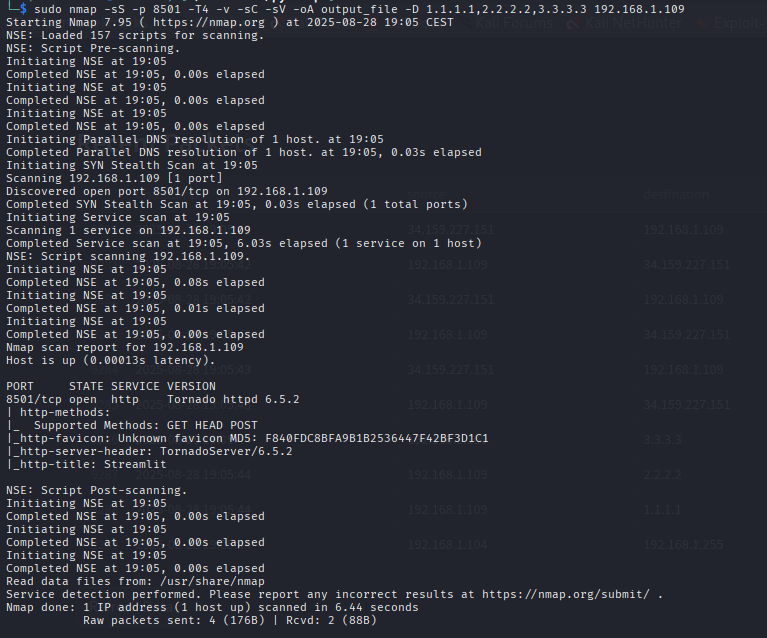
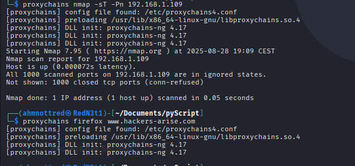

# **Real-time Network Traffic Analysis Dashboard**

## 📑 Table of Contents
- [Overview](#overview)  
- [Motivation](#motivation)  
- [Features](#features)  
- [Architecture & Workflow](#architecture--workflow)  
- [Tools and Technologies](#tools-and-technologies)  
- [Setup Instructions](#setup-instructions)  
- [Usage Guide](#usage-guide)  
- [Screenshots](#screenshots)  
- [Limitations & Future Work](#limitations--future-work)  
- [Conclusion](#conclusion)  

---

## **Overview**
This project is a **real-time packet capture and traffic analysis tool** built with **Python, Scapy, Streamlit, and Plotly**.  
It acts like a lightweight **network monitoring dashboard**: packets are sniffed in real time, processed into structured data, and displayed as **interactive visualizations** and **live metrics**.  

The goal is to make **network traffic analysis accessible** — without requiring heavy enterprise tools like Wireshark or Splunk.  

---

## **Motivation**
I built this project as part of my **cybersecurity learning journey** to:  
- Understand how raw network packets can be captured and decoded in Python.  
- Explore real-time data visualization using dashboards.  
- Simulate **common attacker/defender scenarios** (ping floods, port scans, proxychains traffic) and visualize them in a user-friendly way.  

This dashboard helps bridge **low-level packet sniffing** with **high-level analysis**.  

---

## **Features**
✔️ Real-time **packet capture** (ICMP, TCP, UDP, and others)  
✔️ Protocol breakdown with **interactive pie chart**  
✔️ **Packets per second** timeline for traffic spikes  
✔️ Top source IPs to quickly identify chatty hosts  
✔️ Live statistics:  
   - Total captured packets  
   - Capture duration  
✔️ Auto-refresh for continuous monitoring  
✔️ Tabular view of most recent packets  

---

## **Architecture & Workflow**
1. **Scapy** sniffs packets from the network interface.  
2. Packets are parsed into a structured format (timestamp, src/dst IP, ports, size, protocol).  
3. Data is stored in a **Pandas DataFrame** (thread-safe).  
4. **Streamlit** renders the dashboard:  
   - **Plotly** charts for visualization  
   - **Metrics widgets** for stats  
   - **Live updating table** for recent packets  
5. Auto-refresh every 2 seconds ensures **near real-time visibility**.  

---

## **Tools and Technologies**
- **Kali Linux** – environment for testing (traffic generation, scans, proxychains).  
- **Python 3.x**  
- **Streamlit** – interactive web dashboard.  
- **Scapy** – packet sniffing and parsing.  
- **Plotly Express** – interactive visualizations.  
- **Pandas** – data processing.  

---

## **Setup Instructions**
```bash
# 1. Clone the repository
git clone https://github.com/yourusername/network-traffic-dashboard.git
cd network-traffic-dashboard

# 2. Install dependencies
pip install streamlit scapy plotly pandas

# 3. Run the app (requires root privileges for packet capture)
sudo streamlit run trafficDash.py
```

Open your browser and navigate to:
```
http://localhost:8501/
```

---

## **Usage Guide**
- Once started, the dashboard begins sniffing packets in real time.  
- You can:  
  - Watch protocol usage change dynamically.  
  - Identify unusual spikes in traffic.  
  - Inspect the top IP addresses sending data.  
  - Scroll through the table of recent packets.  
- Test by generating traffic:  
  - `ping` a host for ICMP traffic.  
  - Run `nmap` for scan simulation.  
  - Use `proxychains` for anonymized connections.  

---

## **Screenshots**
### Dashboard Startup



### Generating Traffic (Ping Test)


### Nmap Scan Simulation


### Proxychains Test


### Dashboard Info
[Protocol Distribution](image/tr3.jpg)

[Data Vizualization](image/tr4.jpg)

[Most Recent Packets](image/tn.png)

---

## **Limitations & Future Work**
🔸 Requires **root/admin privileges** for packet capture.  
🔸 Currently captures only from **default network interface**.  
🔸 Memory usage grows with long captures (keeps last 10,000 packets).  

**Planned improvements:**  
- Add **filtering by IP/protocol/port**.  
- Support **multi-interface selection**.  
- Export captured traffic to **.pcap format** for Wireshark.  

---

## ✅ **Conclusion**
This project demonstrates how to:  
- Sniff and parse live network traffic in Python.  
- Transform raw packets into actionable metrics.  
- Visualize real-time network behavior through an accessible dashboard.  

It’s a practical tool for **cybersecurity labs, network troubleshooting, and learning packet-level analysis**.  
