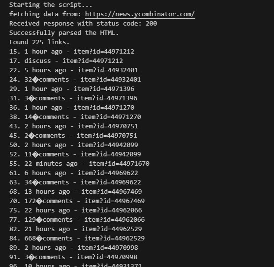
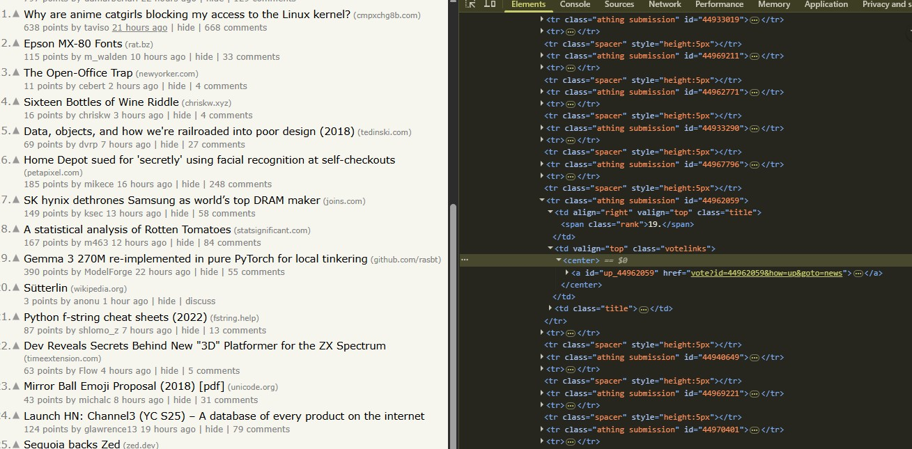
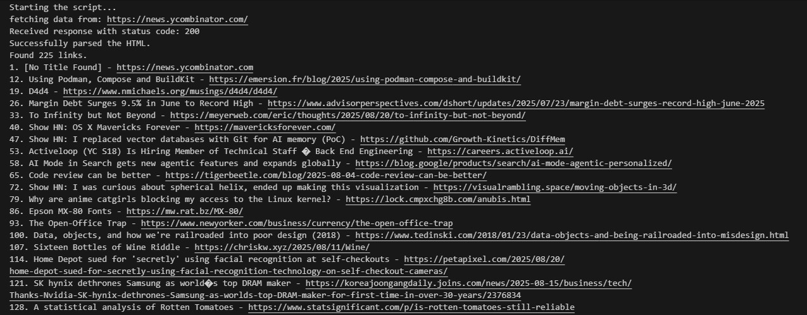
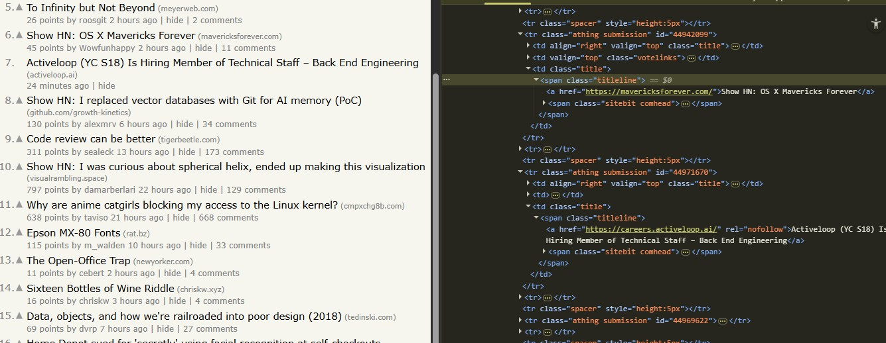

# **Hacker News Web Scraper**

## 📑 Table of Contents
- [Description](#description)
- [Features](#features)
- [Tools and Technologies Used](#tools-and-technologies-used)
- [Project Structure](#project-structure)
- [Setup Instructions](#setup-instructions)
- [Usage](#usage)
- [Example Output](#example-output)
- [Screenshots](#screenshots)
- [Conclusion](#conclusion)

---

## **Description**
This project demonstrates a simple **web scraper** built with Python.  
It extracts both **internal discussion links** and **external article links** from [Hacker News](https://news.ycombinator.com/) using the `requests` library for HTTP requests and `BeautifulSoup` for parsing HTML.

The scraper highlights the difference between links that point to Hacker News discussions (internal) and those that lead to outside articles (external).

---

## **Features**
- Fetches live HTML from Hacker News.  
- Parses and extracts all `<a>` tags.  
- Filters:  
  - Internal links → Hacker News discussion threads (`item?id=`).  
  - External links → Articles (URLs starting with `http://` or `https://`).  
- Prints results in a clean numbered format.  
- Includes screenshots of sample runs.

---

## **Tools and Technologies Used**
- **Python 3.x**
- **requests**
- **BeautifulSoup4**

---

## **Project Structure**
```
webscraper/
├── firstScript.py        # Extracts internal Hacker News links
├── secondScript.py       # Extracts external article links
├── results/              # Screenshots of scraper results
│   ├── 1.jpg
│   ├── 2.jpg
│   ├── 3.jpg
│   └── 4.jpg
└── README.md             # Documentation
```

---

## **Setup Instructions**
1. Navigate to the project folder:
   ```bash
   cd webscraper
   ```

2. Install dependencies:
   ```bash
   pip install requests beautifulsoup4
   ```

---

## **Usage**
Run either script depending on what you want to scrape:

- Internal Hacker News discussion links:
  ```bash
  python firstScript.py
  ```

- External article links:
  ```bash
  python secondScript.py
  ```

---

## **Example Output**

**firstScript.py**
```
Starting the script...
fetching data from: https://news.ycombinator.com/
Received response with status code: 200
Successfully parsed the HTML.
Found 90 links.
1. Example Hacker News Story - item?id=123456
2. Another Story - item?id=789012
```

**secondScript.py**
```
Starting the script...
fetching data from: https://news.ycombinator.com/
Received response with status code: 200
Successfully parsed the HTML.
Found 90 links.
1. Example Article - https://example.com/article
2. Another Link - https://another.com/page
```

---

## **Screenshots**
### Internal Links


### External Links


### Parsed Titles


### Final Output


---

## ✅ **Conclusion**
The Hacker News Web Scraper demonstrates how to:  
- Fetch and parse live web pages.  
- Differentiate between **internal discussion links** and **external article links**.  
- Use Python libraries (`requests`, `BeautifulSoup`) for automation and data collection.  
